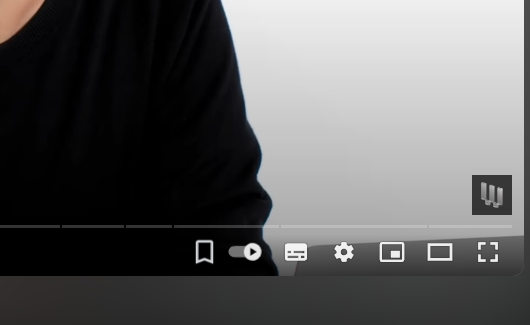

# YouTube Bookmarks Manager

## Overview

The YouTube Bookmarks Manager is a Chrome extension designed to enhance your YouTube viewing experience by allowing you to manage bookmarks for your favorite videos. Whether you want to mark important moments in a video or save timestamps for future reference, this extension provides a simple and effective way to do so. With features for adding, viewing, and deleting bookmarks, you can easily keep track of key moments in your YouTube videos.

## Features

### Bookmark Addition

- **In-Player Bookmarking**: Add bookmarks directly from the YouTube player controls. A dedicated bookmark button is added to the player, allowing you to mark any point in the video with a single click.
- **Keyboard Shortcut**: Use the keyboard shortcut `Alt + B` to add a bookmark at the current video timestamp without needing to interact with the player controls.

### View Bookmarks

- **Current Video Bookmarks**: The extension's popup displays all bookmarks for the currently active video. You can view these bookmarks along with their timestamps, and manage them directly from the popup interface.
- **All Bookmarks**: Access a comprehensive list of bookmarks across all your YouTube videos. This feature lets you see all saved bookmarks in one place, organized by video title.

### Delete Bookmarks

- **Individual Bookmark Deletion**: Remove specific bookmarks from the current video by using the delete button next to each bookmark in the popup.
- **Delete All Bookmarks for a Video**: Clear all bookmarks for a particular video with a single action, helping you keep your list organized.

### User Interface

- **Clean and Intuitive Design**: The popup interface is designed to be user-friendly and visually appealing. It features a dark theme that blends seamlessly with YouTube's interface and provides easy access to your bookmarks.
- **Responsive Layout**: The popup adjusts to different screen sizes and resolutions, ensuring a consistent experience across devices.

## How It Works

### When You Are on a YouTube Video Page

If you are currently viewing a YouTube video, the extension's popup will display bookmarks specific to that video. Here's how it functions:

- **View Bookmarks**: The popup will list all bookmarks associated with the current video. Each bookmark is displayed with a description of the timestamp (e.g., "Bookmark at 01:23").
- **Play Bookmark**: Clicking the "Play" button next to a bookmark will change the seek time of the video to the bookmarked timestamp. This action allows you to jump directly to your favorite part of the video.
- **Delete Bookmark**: Clicking the "Delete" button will remove the specific bookmark from the video. The bookmark will be deleted, and the popup will update to reflect this change.

### When You Are on Other YouTube Pages

If you are not on a specific YouTube video page, such as the YouTube homepage or any other non-video page on YouTube, the extension's popup will show a list of all videos for which you have saved bookmarks. Here's what you can do:

- **View All Bookmarked Videos**: The popup will display titles of all videos that contain bookmarks. Each row in the list will include the video title, along with "Play" and "Delete" buttons.
- **Play Video**: Clicking the "Play" button will open the video in a new tab, allowing you to watch it directly.
- **Delete All Bookmarks**: Clicking the "Delete" button will remove all bookmarks associated with the selected video. This action clears all timestamps for that video from the storage.

## Installation

To install the YouTube Bookmarks Manager extension, follow these steps:

1. **Download the Extension Files**:
   - Clone or download the repository containing the extension files from [GitHub](https://github.com/yusufbadr/youtube-bookmarks-manager.git).

2. **Open Chrome**:
   - Launch Google Chrome on your computer.

3. **Access the Extensions Page**:
   - Navigate to `chrome://extensions/` in your browser's address bar.

4. **Enable Developer Mode**:
   - Toggle the "Developer mode" switch in the top right corner of the Extensions page.

5. **Load Unpacked Extension**:
   - Click on the "Load unpacked" button and select the directory containing the extension files.

6. **Verify Installation**:
   - The extension should now appear in your list of installed extensions. You can click the extension icon to start using it.

## Behind the Scenes

### Popup Interface

The popup interface of the extension provides various functionalities for managing bookmarks:

- **Displaying Current Video Bookmarks**: When you open the popup while on a YouTube video page, it shows all bookmarks for the current video. You can see the video title and a list of bookmarks with options to play or delete them.
- **Viewing All Bookmarks**: When on any other YouTube page, the popup displays a list of all videos with saved bookmarks. You can view the video titles and manage bookmarks for each video.

### Content Script

The content script interacts with the YouTube player and performs the following tasks:

- **Adding Bookmarks**: The script adds a bookmark button to the YouTube player controls. When clicked, it saves the current timestamp as a bookmark in the browser's local storage.
- **Handling Bookmark Actions**: It listens for messages from the popup to perform actions such as playing a bookmark or deleting a bookmark. The script updates the video player and the storage accordingly.

### Background Script

The background script is responsible for:

- **Monitoring URL Changes**: It listens for updates to the active tab and detects when a new YouTube video is loaded. It then sends a message to the content script to handle the new video.
- **Providing Active Tab URL**: It responds to requests for the URL of the active tab, allowing the content script to determine if the current page is a YouTube video.

## Files and Structure

- **`popup.js`**: Contains the logic for interacting with the popup UI, including functions to display bookmarks, add new bookmarks, and handle user interactions.
- **`content.js`**: Manages interactions with the YouTube video player on video pages, including adding bookmarks and responding to messages from the popup.
- **`background.js`**: Handles background tasks such as monitoring tab updates and managing communication between the content script and popup.
- **`popup.html`**: The HTML structure for the popup interface.
- **`styles.css`**: The stylesheet for styling the popup interface.
- **`assets/`**: Directory with images for bookmark buttons and icons.

## Screenshots

**Bookmark Button:**

## Screenshots

## Screenshots

**Bookmark Button:**

  

 

**Current Video Page:**

  

 

**Other YouTube Pages:**

  

## Contributing

Contributions are welcome! Please open an issue or submit a pull request with any changes or improvements.
